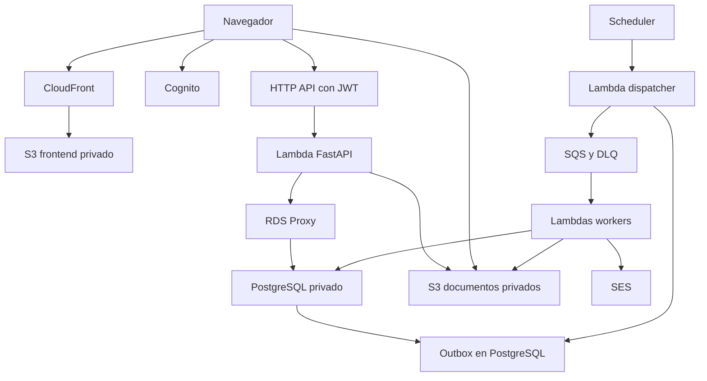

# Aula virtual escolar — Arquitectura y guía de implementación para Claude

Fecha: 7 de septiembre de 2026. Versión: 1.0.
Estado: especificación propuesta para iniciar desarrollo; no representa infraestructura ya desplegada ni capacidad certificada.
Idioma de interfaz y documentación: español. Código, tablas y endpoints: inglés.

## 1. Instrucción inicial para Claude

Actúa como ingeniero principal full stack y de infraestructura. Implementa una plataforma escolar a medida siguiendo este documento. Primero inspecciona el repositorio y sus instrucciones; conserva trabajo existente. Si está vacío, crea el monorepositorio descrito abajo. Trabaja por entregas verticales funcionales, con migraciones, pruebas de comportamiento y documentación. No entregues solamente pantallas con datos simulados.

Usa las decisiones propuestas como valores iniciales configurables. No bloquees el desarrollo por marca, dominio, región, nombres de grados o escala de notas: usa configuración y datos ficticios explícitos. Registra los supuestos en `docs/ASSUMPTIONS.md` y decisiones relevantes en `docs/adr/`.

Primera entrega: infraestructura sintetizable, ejecución local reproducible y flujo real de autenticación/autorización, creación de materia y curso, matrícula, tarea, entrega y consulta por padre autorizado. Después continúa las fases de la sección 20. No intentes construir todos los módulos a la vez.

No inventes credenciales, cuentas AWS, ARN, correos de destinatarios, políticas escolares ni resultados de pruebas. Prepara código, plantillas y planes de despliegue; el despliegue con costo, DNS de producción, envío de invitaciones reales y migración de datos reales requieren autorización del propietario. No se solicita desplegar al recibir este archivo.

## 2. Contexto, decisiones y alcance

### Confirmado por el propietario

- Colegio de aproximadamente 600 alumnos.
- Desarrollo a medida.
- Preferencia por AWS Lambda y arquitectura serverless para elasticidad.
- Existe hosting HostGator Standard con cPanel, Apache y MySQL; no será la base de producción de esta propuesta.

### Propuesto para avanzar

- Un colegio por instalación; preparar `school_id` para aislamiento lógico, sin construir todavía un SaaS multicolegio.
- Backend Python/FastAPI; frontend React/TypeScript; PostgreSQL en RDS.
- AWS CDK en TypeScript como única fuente de infraestructura.
- Región inicial parametrizable `us-east-1`, sujeta a validación de residencia, latencia y servicios.
- Zona horaria escolar `America/El_Salvador`; persistir instantes como UTC/timestamptz.
- Moneda USD, configurable. Notas y reglas de aprobación configurables.
- Usuarios: administración, coordinación, docentes, alumnos y padres/tutores.
- Matrículas, aulas, materiales, tareas, asistencia, calificaciones, evaluaciones y avisos son el alcance académico propuesto.
- Panel administrativo de mora y pagos manuales es una fase opcional, no condición del primer MVP.

### Fuera del primer alcance

Videollamadas propias, streaming propio, proctoring, biometría, chat en tiempo real, app móvil nativa, IA evaluadora, nómina, contabilidad completa, pasarela de pago y multiinstitución comercial. Mantener puntos de extensión sin implementarlos anticipadamente.

## 3. Arquitectura general

Monolito modular desplegado en una Lambda HTTP y varias funciones de trabajo. Compartir dominio y contratos, con permisos IAM distintos por función. No crear una Lambda por endpoint ni microservicios por cada entidad.



El navegador solo accede a documentos mediante una autorización temporal emitida por la API. La flecha a S3 no implica bucket público. Los workers que usan DB acceden a través del proxy; las flechas del diagrama son lógicas y no enumeran todos los saltos de red. El frontend recibe el token de Cognito y lo envía a API Gateway.

| Capa | Elección | Responsabilidad |
|---|---|---|
| Web | React, TypeScript, Vite | SPA adaptable a móviles |
| UI | Tailwind, componentes accesibles, TanStack Query | Interfaz, formularios y estado de servidor |
| Formularios | React Hook Form + Zod | Validación cliente; servidor siempre vuelve a validar |
| API | HTTP API + Lambda + FastAPI + Mangum | HTTP, validación, permisos y casos de uso |
| Persistencia | SQLAlchemy 2 + psycopg 3 + Alembic | Repositorios y migraciones PostgreSQL |
| Identidad | Cognito User Pool | Contraseñas, MFA, recuperación y tokens |
| Acceso a DB | RDS Proxy | Control y reutilización de conexiones |
| Documentos | S3 | Archivos privados y exportaciones temporales |
| Asíncrono | Outbox + SQS + Lambda | Trabajo reintentable sin bloquear HTTP |
| Programación | EventBridge Scheduler | Dispatcher y recordatorios periódicos |
| Correo | SES | Notificaciones transaccionales |
| Operación | CloudWatch, alarmas, trazas muestreadas | Diagnóstico y métricas |
| Secretos | Secrets Manager | Credenciales de base de datos |
| Infraestructura | CDK/CloudFormation | Recursos versionados por ambiente |

Fijar versiones concretas y lockfiles tras comprobar compatibilidad. Python 3.12 es la base propuesta; comprobar soporte vigente en Lambda antes del despliegue. No combinar Terraform, SAM y Serverless Framework para administrar los mismos recursos. “Serverless” aquí describe el patrón AWS, no exige Serverless Framework.

## 4. Backend y ejecución en Lambda

- API única con módulos separados: identity, academics, learning, assessments, attendance, grading, communications, files, reporting y billing opcional.
- Capas: routers → services → repositories → database. Los routers no contienen reglas de negocio ni SQL.
- Dependencias explícitas para sesión DB, usuario actual, contexto de colegio y autorización.
- Propuesta inicial: SQLAlchemy y psycopg síncronos, endpoints `def` para operaciones con DB. Evitar bloquear el event loop con I/O síncrono dentro de `async def`.
- Engine creado fuera del handler; sesión nueva por solicitud y cierre garantizado. Nunca compartir Session o transacción entre invocaciones.
- Cliente conectado al endpoint de RDS Proxy con TLS y validación de certificado. Pool local pequeño, inicialmente 1 conexión + 0 overflow por entorno; medir antes de cambiar.
- Comprobar comportamiento de prepared statements y cambios de sesión con RDS Proxy. No asumir que toda conexión se multiplexa: el pinning puede reducir el beneficio [S2].
- Timeout HTTP inicial de Lambda: 25 segundos; transacciones habituales deben ser mucho más cortas. Objetivo de query habitual inferior a 1 segundo, `statement_timeout` inicial 5 segundos para el rol API, y límite de espera de locks. Configurar parámetros a nivel de rol cuando sea viable; verificar impacto en proxy.
- Memoria API inicial: 1.024 MB, ajustable tras pruebas. No equivale a dimensionamiento definitivo.
- Reservar inicialmente 30 ejecuciones para API y 5 para trabajos DB; validar cuotas de la cuenta y ajustar con resultados. No subir concurrencia sin revisar DB y latencia del proxy.
- Evitar provisioned concurrency inicialmente; habilitar solo si la medición demuestra que los cold starts incumplen el objetivo.
- No ejecutar migraciones, seeds ni creación de tablas al importar el handler o en cada cold start.
- Reportes largos responden 202 y se procesan mediante job. Si no caben en el límite de Lambda, diseñar ejecución posterior en ECS/Fargate; no fraccionar arbitrariamente para ocultar un timeout.

## 5. Infraestructura y red

### Ambientes

Local, dev, staging y prod, con configuración independiente. Producción idealmente en cuenta AWS separada. Como mínimo separar buckets, DB, secretos, colas, Cognito, dominios y roles por ambiente. No compartir datos de alumnos entre entornos. Staging puede ser temporal para controlar costo, pero debe reproducir proxy, IAM y red antes de lanzar.

### Topología inicial elegida

- VPC en dos zonas de disponibilidad.
- Subredes privadas de aplicación para Lambdas con DB y privadas de datos para RDS/Proxy.
- RDS sin acceso público; SG de RDS permite 5432 desde SG del proxy y, únicamente, desde runner autorizado de migraciones. SG del proxy permite 5432 desde Lambdas autorizadas.
- Para la primera implementación, usar salida IPv4 mediante NAT: uno en dev/piloto, configurable por AZ en producción. Documentar costo fijo, transferencia entre AZ y punto de falla si se mantiene solo uno.
- S3 Gateway Endpoint para acceso privado a S3 desde la VPC. Evaluar endpoints de interfaz para SQS/Secrets Manager contra costo del NAT; no habilitar todos automáticamente.
- Conectar una Lambda a una subred pública no le da IP pública ni salida a internet [S3].
- Función de envío de correo sin VPC si no requiere DB. La función que genera notificaciones y el dispatcher sí usan DB. Si el worker de correo requiere registrar resultados, publicarlos en una cola de resultados; un worker DB actualiza estados.
- Documentar qué función necesita DB, S3, SQS, Secrets Manager, Cognito/JWKS o internet. Resolver su ruta de salida explícitamente.
- No usar SSH abierto ni DB pública para ejecutar migraciones. Runner de CodeBuild en VPC para migraciones cloud; GitHub Actions lo inicia con OIDC y permisos limitados.

### Frontend y dominios

- S3 privado, CloudFront Origin Access Control y HTTPS.
- Dominio propuesto `aula.<dominio>` y API `api-aula.<dominio>`; placeholders hasta disponer de dominio.
- Certificado CloudFront en región requerida por ese servicio; certificado API en la región de la API. Gestionar validación DNS mediante IaC cuando se autorice.
- SPA: reescribir rutas sin extensión a `/index.html`; no convertir todos los errores de assets en HTTP 200.
- Assets con hash y caché larga; `index.html` con caché corta/revalidación.
- No cachear respuestas de API con datos personales mediante CloudFront en el MVP.
- CORS limitado a orígenes configurados. CSP, HSTS y cabeceras de seguridad probadas con el flujo Cognito.

## 6. Autenticación y permisos

### Identidad

- Cognito User Pool y cliente público de SPA sin client secret.
- Authorization Code + PKCE mediante biblioteca mantenida compatible con Cognito. Prohibir registro público; altas e invitaciones administradas.
- Resource server con scope de acceso a API, por ejemplo `school-api/access`; solicitarlo en OAuth y exigirlo en rutas protegidas.
- Enviar access token, nunca utilizar ID token como credencial de la API. JWT authorizer de HTTP API valida issuer/audience y scope; backend verifica también `token_use=access`, `client_id` esperado, `sub` y usuario activo. HTTP API puede aceptar scopes alternativos; no tratarlos como comprobación AND [S1].
- `users.cognito_sub` es vínculo estable; nunca confiar en email como identificador de autorización.
- Tokens preferentemente en memoria, sin persistir JWT en localStorage. Recuperación y renovación mediante biblioteca; comprobar comportamiento entre recargas. No introducir cookies personalizadas inseguras.
- MFA obligatorio para personal con privilegios como meta de producción; configurar y probar enrolamiento en Cognito. Manejar alumnos sin correo: usar username institucional y procedimiento de recuperación escolar, no inventar emails. Esta política debe cerrarse antes de altas reales.
- Autorización y estado activo se consultan en DB en cada solicitud; revocar permisos locales debe surtir efecto aunque el access token siga vigente.
- No asumir que cerrar sesión invalida inmediatamente un JWT ya emitido. Para respuesta a incidentes, usuario desactivado en DB y bloqueo en Cognito.

### RBAC y alcance de datos

| Rol | Acceso |
|---|---|
| school_admin | Configuración y gestión del colegio, con acciones auditadas |
| coordinator | Supervisión académica y reportes del colegio |
| teacher | Solo cursos asignados, alumnos matriculados en ellos y actividades propias autorizadas |
| student | Cursos matriculados, materiales publicados, entregas y calificaciones propias publicadas |
| guardian | Solo alumnos con vínculo vigente y datos publicados autorizados |
| finance | Cargos y pagos, sin edición académica; módulo opcional |

Permisos granulares: `users:manage`, `academics:manage`, `course:read`, `assignment:manage`, `submission:create`, `submission:grade`, `attendance:manage`, `grade:publish`, `report:read`, `billing:manage`. Mantener un catálogo versionado y asignaciones por usuario/colegio. Un usuario puede tener varios roles.

Regla universal: verificar colegio + permiso + vínculo con el recurso. Ocultar un botón no protege datos. El `school_id` efectivo se deriva de la membresía autenticada y se valida en cada repositorio; no aceptarlo sin validación desde body o header. Aplicar el filtro también a listados, exportaciones, joins y presigned URLs.

Los UUID no sustituyen autorización. Probar acceso cruzado docente/alumno/tutor y entre colegios ficticios. Objetivo: ningún recurso filtrado por identificador. Responder 404 cuando corresponda ocultar existencia de un recurso ajeno.

## 7. Modelo de datos propuesto

Convenciones: UUID como PK, snake_case, `created_at`/`updated_at` timestamptz, `school_id` en tablas del dominio. Importes NUMERIC, nunca float. Añadir `created_by` cuando importa autoría. Usar claves foráneas e índices; no modelar toda la plataforma en JSONB.

En entidades hijas, garantizar el mismo colegio que el padre con FK compuesta `(school_id, parent_id)` y unicidad correspondiente. Soft delete solo donde existe una política clara; preferir estados para matrículas, cursos, notas y pagos. No cascadas destructivas sobre historial académico.

### Identidad y estructura

| Tabla | Campos principales y restricciones |
|---|---|
| schools | name, timezone, currency, status |
| users | cognito_sub unique nullable durante invitación, display_name, email nullable, status |
| school_memberships | school_id, user_id, status; unique(school_id,user_id) |
| roles / permissions / role_permissions | Catálogo y matriz de permisos |
| membership_roles | membership_id, role_id; unique por combinación |
| student_profiles | school_id, user_id nullable, student_number; unique(school_id,student_number) |
| guardian_student_links | school_id, guardian_user_id, student_id, relationship, status, valid_from/to; vínculo auditado |
| academic_years | school_id, label, starts_on, ends_on, status |
| grading_periods | academic_year_id, name, starts_on, ends_on, status |
| grade_levels | school_id, name, sort_order |
| sections | academic_year_id, grade_level_id, name; unique por año/grado/nombre |
| subjects | school_id, code, name |
| courses | section_id, subject_id, academic_year_id, status; unique por sección/materia/año |
| course_teachers | course_id, teacher_user_id, status |
| enrollments | academic_year_id, student_id, section_id, starts_on, ends_on, status |
| course_enrollments | course_id, student_id, enrollment_id, status; unique(course_id,student_id) |

Cambios de sección conservan historial y fechas. La matrícula inicial genera inscripciones de cursos transaccionalmente; mover alumno no borra entregas ni notas anteriores. Definir política escolar de traslado antes de habilitar esa operación en producción.

### Aprendizaje y calificaciones

| Tabla | Campos principales y restricciones |
|---|---|
| course_units | course_id, title, position, status |
| lessons | unit_id, title, body, position, published_at |
| assignments | course_id, title, instructions, due_at, max_score, status, allow_late, grading_period_id |
| assignment_attachments | assignment_id, file_id |
| submissions | assignment_id, student_id, status, current_revision_id, submitted_at, version; unique(assignment_id,student_id) |
| submission_revisions | submission_id, revision_number, body, created_at; unique por revisión |
| submission_files | revision_id, file_id |
| grade_items | course_id, period_id, category_id, title, max_score, assignment_id nullable unique, assessment_id nullable unique |
| grade_categories | course_id, period_id, name, weight |
| grades | grade_item_id, student_id, score nullable, status, feedback, version, graded_by; unique(item,student) |
| grade_revisions | grade_id, before_value, after_value, reason, actor_id, created_at |
| attendance_sessions | course_id, session_date, slot; unique(course,date,slot) |
| attendance_records | session_id, student_id, status, note; unique(session,student) |
| announcements | scope_type, scope_id, title, body, published_at, expires_at |
| calendar_events | title, starts_at, ends_at, audience_type, audience_id |

Estados de nota: draft, published, excused. Una nota ausente no es cero. La fórmula de promedio, ponderación de categorías, tratamiento de pendientes, escala y redondeo son configuración versionada del curso/período. Bloquear publicación de promedios con pesos inválidos. No codificar un umbral fijo de aprobación.

### Evaluaciones

| Tabla | Campos principales y restricciones |
|---|---|
| assessments | course_id, title, opens_at, closes_at, duration_seconds, max_attempts, status |
| assessment_versions | assessment_id, version_number, published_at, grading_config; publicación inmutable |
| questions | version_id, type, prompt, points, position |
| question_options | question_id, label, position |
| question_answer_keys | question_id, grading_data; repositorio y serialización restringidos |
| assessment_attempts | assessment_id, version_id, student_id, attempt_number, started_at, expires_at, status, submitted_at; unique por alumno/evaluación/número |
| attempt_answers | attempt_id, question_id, answer, version, saved_at; unique(attempt,question) |
| attempt_question_order | attempt_id, question_id, position, option_order |

MVP de preguntas: selección única y respuesta abierta. Publicar una evaluación fija su versión; editar crea otra versión, sin modificar intentos iniciados. Guardar orden aleatorio una vez por intento, si se habilita. Nunca serializar respuesta correcta ni campos internos de corrección para alumnos.

### Operación y archivos

| Tabla | Campos principales y restricciones |
|---|---|
| files | owner_user_id, bucket, object_key, object_version_id, size, mime_type, checksum, status, purpose |
| notifications | recipient_user_id, type, payload mínimo, read_at |
| report_jobs | requested_by, report_type, filters, status, file_id, error_code, expires_at |
| outbox_events | event_id, type, aggregate_id, schema_version, payload, available_at, published_at, attempts, lease_until |
| processed_events | consumer_name, event_id, processed_at; unique(consumer,event) |
| idempotency_records | school_id, actor_id, operation, key, request_hash, response_status, response_body, expires_at; unique por alcance/key |
| audit_events | actor_id, action, target_type/id, request_id, changes redactados, occurred_at |

Índices iniciales: matrículas por alumno/año/estado; cursos por sección/año; tareas por curso/estado/fecha; entregas por tarea/estado; notas por alumno/período mediante joins indexados; intentos por alumno/evaluación y por estado/expiración; outbox pendiente por available_at; auditoría por colegio/fecha. Revisar con EXPLAIN y cargas reales, no crear índices para cada columna.

### Cobros opcionales, fase posterior

`charges`, `payments`, `payment_allocations`, `payment_reversals`. Cargo con monto/fecha de vencimiento/alumno; pago manual con referencia y autor; asignación parcial a cargos. Reversos auditados, no borrar pagos. Saldo calculado como cargos menos asignaciones netas válidas. Mora solo para saldo vencido positivo. No almacenar tarjetas. El módulo no representa contabilidad fiscal ni pasarela.

## 8. Contrato HTTP

Base `/api/v1`, JSON UTF-8, fechas ISO 8601 UTC, UUID en strings. Paginación por cursor estable, límite por defecto 25 y máximo 100. Filtros y orden permitidos explícitamente. Generar cliente TypeScript desde OpenAPI; detectar cambios incompatibles en CI.

Errores uniformes:

```json
{"error":{"code":"RESOURCE_CONFLICT","message":"El recurso cambió; actualiza e intenta nuevamente.","details":{}},"request_id":"uuid"}
```

Usar 401 sin autenticación válida, 403 permiso insuficiente, 404 inexistente/ajeno, 409 conflicto de versión/estado, 422 validación, 429 límite y 503 indisponibilidad temporal. No devolver stack traces. Registrar correlation ID en API, outbox y workers.

| Grupo | Endpoints mínimos |
|---|---|
| Sesión | GET /me; GET /me/permissions; GET /me/students |
| Usuarios | GET /users; POST /users/invitations; PATCH /users/{id}/status |
| Estructura | CRUD /academic-years, /sections, /subjects, /courses; POST /courses/{id}/teachers |
| Matrícula | POST /enrollments; GET /students/{id}/enrollments |
| Contenido | GET /courses/{id}/content; POST /courses/{id}/units; POST /units/{id}/lessons; POST /lessons/{id}/publish |
| Tareas | GET/POST /courses/{id}/assignments; PATCH /assignments/{id}; POST /assignments/{id}/publish |
| Entregas | PUT /assignments/{id}/my-submission; POST /assignments/{id}/my-submission/submit; GET /assignments/{id}/submissions |
| Notas | PUT /grade-items/{id}/students/{student_id}/grade; POST /grades/{id}/publish; GET /students/{id}/grades |
| Asistencia | POST /courses/{id}/attendance-sessions; PUT /attendance-sessions/{id}/records; GET /students/{id}/attendance |
| Exámenes | POST /courses/{id}/assessments; POST /assessments/{id}/publish; POST /assessments/{id}/attempts |
| Respuestas | GET /attempts/{id}; PUT /attempts/{id}/answers/{question_id}; POST /attempts/{id}/submit |
| Archivos | POST /files/upload-intents; POST /files/{id}/complete; GET /files/{id}/download-url |
| Avisos | GET/POST /announcements; GET /calendar-events; GET /notifications; PATCH /notifications/{id}/read |
| Reportes | POST /reports; GET /reports/{id}; GET /reports/{id}/download-url |
| Paneles | GET /dashboards/student; /teacher; /guardian; /admin |

`CRUD` en esta tabla exige listar operaciones concretas en OpenAPI; los deletes de estructura referenciada se convierten en archivo/inactivación o se rechazan. No exponer un borrado genérico de historial.

Toda mutación sensible incluye versión para concurrencia optimista. Solicitudes de inicio/entrega de examen, entrega final, invitación y pagos requieren `Idempotency-Key`. Repetir la clave y mismo contenido devuelve resultado original; misma clave con otro contenido produce 409. El registro idempotente y la mutación DB se confirman en la misma transacción. Expiración inicial 7 días para operaciones académicas; para pagos conservar clave de negocio única permanentemente.

## 9. Flujos críticos

### Publicar y entregar tarea

1. Docente asignado crea borrador y adjunta archivos autorizados.
2. Publicar valida fechas, curso, max_score y archivos disponibles; crea evento outbox en la misma transacción.
3. Alumno matriculado ve únicamente contenido publicado.
4. Guarda borrador con versión; cada entrega confirmada fija una revisión inmutable.
5. Servidor decide entrega tardía según hora de recepción y política configurada.
6. Docente califica, conserva revisión y publica. Padre vinculado y alumno ven solo notas publicadas.

### Guardado de exámenes

1. Inicio valida matrícula, ventana, cantidad de intentos y clave idempotente dentro de una transacción con bloqueo adecuado. Índice parcial evita más de un intento activo por alumno/evaluación.
2. `expires_at = min(started_at + duration, closes_at)`; acomodaciones individuales deben ser campos explícitos y auditados si se implementan.
3. Respuestas se guardan por pregunta, con versión monotónica. Una respuesta atrasada nunca sobrescribe una más nueva; conflictos devuelven 409 y versión del servidor.
4. Autosave tras cambio, debounce inicial de 2 segundos y vaciado periódico máximo de 15 segundos si hay cambios. No escribir cuando no cambió nada.
5. UI distingue “pendiente”, “guardando”, “guardado en servidor” y “sin conexión”. No afirmar guardado hasta recibir confirmación. En el MVP, memoria del navegador conserva cambios durante una desconexión breve; cerrar/recargar puede perder cambios sin sincronizar y la interfaz debe advertirlo.
6. El reloj del servidor manda. Después de expires_at se rechazan cambios aunque aún no corra el job de cierre. La finalización conserva respuestas previamente confirmadas.
7. Submit y expiración compiten por el mismo bloqueo de intento; una sola transición terminal y un solo evento de corrección. Retry de submit devuelve el resultado existente.
8. Job periódico finaliza vencidos y crea trabajo de corrección. No depender de ese job para impedir respuestas fuera de tiempo.
9. Corrección automática solo para tipos objetivos; abiertas requieren docente. Publicación de resultados es independiente de corrección.
10. Probar cierre simultáneo, pérdida de red, doble clic, múltiples pestañas y respuesta fuera de orden.

### Archivos privados

1. API valida permiso, propósito, tipo declarado y tamaño; genera key no elegida por el cliente y registro `pending_upload`.
2. Emitir presigned POST con restricciones de tamaño y key; duración inicial 5 minutos. Límite propuesto 20 MB por archivo, configurable. Nunca transportar el binario en JSON por API Gateway.
3. Cliente sube al prefijo de cuarentena. Complete valida objeto real con HEAD, tamaño y metadatos; no confía solo en el browser.
4. Proceso de validación comprueba formato real y escaneo antimalware mediante integración seleccionada antes de producción. Estado `pending_scan`, `available` o `rejected`; mientras no exista scanner real no marcar archivos reales como seguros. En local usar adaptador explícitamente ficticio.
5. Copiar versión validada a key final inmutable o fijar VersionId; evita que un URL de carga aún vigente reemplace bytes ya validados.
6. Descarga solo tras verificar autorización sobre el recurso padre y estado available; URL temporal de 60–300 segundos. No registrar esas URLs.
7. Usar Content-Disposition attachment para formatos activos/no seguros y sanitizar nombres. Prohibir HTML ejecutable inline.
8. Versioning y lifecycle; eliminar multipart incompletos y cuarentena huérfana. Plazos finales sujetos a política escolar.

### Outbox y trabajos

- Escribir cambio y evento en una transacción; no depender de publicar SQS después del commit sin mecanismo de recuperación.
- Scheduler invoca dispatcher cada minuto. Dispatcher toma lote con `FOR UPDATE SKIP LOCKED`, asigna lease, confirma y publica fuera de la transacción; marca éxito después.
- Si publica y falla antes de marcar, habrá duplicado. Event ID estable + consumer idempotente lo absorben. Lease vencido habilita reintento.
- SQS Standard con DLQ; consumidores aceptan entrega al menos una vez y posible desorden.
- `processed_events` y modificación de negocio en la misma transacción. Para SES/externalidades no prometer exactamente una vez: un fallo después de enviar puede producir un duplicado. Documentar política de conciliación y deduplicación disponible.
- Respuesta parcial de lote mediante `ReportBatchItemFailures`; reintentar solo mensajes fallidos. Visibility timeout al menos seis veces timeout de función más batch window [S4].
- Esquema: event_id, event_type, schema_version, school_id, aggregate_id, occurred_at, correlation_id, payload mínimo. No enviar tokens, credenciales ni documentos completos.

## 10. Interfaz y experiencia

Diseño institucional sobrio, accesible y responsive; marca configurable, sin inventar identidad visual definitiva. Navegación por rol, con selector de contexto cuando alguien tiene varios roles. Pantallas reales de carga, vacío, error, permiso denegado y sin conexión.

- Alumno: cursos, próximas tareas, calendario, entregas, notas publicadas y exámenes.
- Docente: cursos asignados, pendientes de calificar, editor de tareas, asistencia y libro de notas.
- Tutor: selector de hijos vinculados, tareas, asistencia y notas; nunca búsqueda libre de otros alumnos.
- Coordinación/administración: estructura escolar, matrícula, indicadores y reportes; permisos según rol.
- Finanzas opcional: saldo y mora con acceso separado.
- Accesibilidad: teclado, foco visible, labels, contraste, errores junto al campo y tablas utilizables en móvil.
- Fechas mostradas en timezone escolar; indicar zona en exámenes y plazos.
- No guardar respuestas académicas sensibles en analytics, consola ni herramientas de replay.
- Formularios y API comparten contratos; nunca usar mocks como fallback silencioso en producción.

## 11. Seguridad y privacidad operativa

- IAM mínimo por función y recurso. No credenciales AWS en frontend; no acciones administrativas mediante rutas públicas.
- Cifrado en tránsito y en reposo; buckets con Block Public Access y políticas que exigen TLS.
- Secretos fuera de Git y `.env.example` con placeholders. Logs redactan Authorization, cookies, credenciales, contenido de respuestas y URLs firmadas.
- Auditoría de permisos, vínculos tutor/alumno, publicación/modificación de notas, pagos, exportaciones y desactivaciones. Rol de aplicación puede insertar auditoría pero no actualizarla/borrarla.
- Sanitizar rich text con allowlist; evitar HTML arbitrario. Queries parametrizadas. Limitar cuerpos JSON, cantidad de filtros y tamaño de exportaciones.
- Throttling en API Gateway para proteger infraestructura; autorización por recurso para proteger datos. No asumir integración WAF directa con HTTP API; evaluar compatibilidad si se agrega una capa WAF.
- Exportación masiva requiere permiso propio, TTL de archivo y auditoría. Proteger CSV contra fórmulas al abrir en Excel.
- Definir retención, borrado y acceso a datos con el colegio antes del lanzamiento. Esto no constituye dictamen legal ni garantiza cumplimiento regulatorio.
- Datos de pruebas sintéticos; no copiar producción a desarrollo.

## 12. Capacidad, métricas y pruebas de carga

Los siguientes valores son objetivos de ensayo, no garantías ni cifras medidas:

| Escenario | Carga inicial |
|---|---|
| Uso cotidiano | 50 usuarios activos navegando y entregando tareas |
| Examen de varios grados | 150 usuarios durante 45–60 minutos |
| Pico de validación | 300 usuarios con arranque/entrega concentrados |
| Crecimiento | Ensayo exploratorio de 600 usuarios, sin asumir compromiso de servicio |

600 alumnos registrados no son 600 requests simultáneos. Modelo: requests/s ≈ usuarios activos × solicitudes/minuto ÷ 60. Ejemplo: 150 usuarios con 4 guardados/minuto generan 10 requests/s de guardado, más navegación y picos. Concurrencia Lambda aproximada = requests/s × duración media; incluir cold starts y percentiles en medición.

Objetivos iniciales en staging: p95 menor a 1 segundo para lecturas habituales y menor a 1,5 segundos para guardar respuesta; error 5xx inferior a 0,5% en escenario objetivo; cero respuestas confirmadas perdidas. Medir 429 por separado y no esconderlos del informe. Registrar cold/warm y latencia de cliente además del backend.

Usar k6 o Locust con datos sintéticos, tiempos de lectura realistas y mezcla de acciones. Antes de aumentar Lambda, revisar queries, locks, conexiones, CPU, memoria libre e I/O DB. RDS fijo no se vuelve elástico por usar Lambda o Proxy.

## 13. Base de datos, respaldo y recuperación

RDS PostgreSQL provisionado inicialmente; ejemplo de dimensionamiento a evaluar: familia Graviton burstable de 2 vCPU/4 GB, almacenamiento gp3 de 30–50 GB con autoscaling limitado. Comprobar clase/región/versiones y costos; no elegir instancia por estas cifras sin prueba.

- Dev/piloto puede usar Single-AZ. Producción propone Multi-AZ si el presupuesto y disponibilidad lo requieren; dejar decisión explícita antes del lanzamiento. No presentar Single-AZ como alta disponibilidad.
- Backup automático y recuperación a un punto en el tiempo; retención propuesta de 14 días en producción, sujeta a política y costo.
- Deletion protection, snapshot final y política RETAIN para DB/buckets de producción.
- RPO propuesto ≤15 minutos y RTO ≤4 horas para desastre recuperable, sujetos a un simulacro que los valide. Backup configurado no garantiza esos objetivos.
- Runbook: restaurar nueva instancia, comprobar integridad y usuarios/roles, actualizar destino de proxy/configuración, probar aplicación y habilitar tráfico. No sobrescribir original durante verificación.
- Restaurar también acceso a objetos/versiones S3, configuración y vínculos de Cognito; respaldar SQL no respalda identidades de Cognito. Documentar recuperación del User Pool y procedimiento de restablecimiento de cuentas; no prometer restaurar contraseñas desde DB.
- Auditoría y eventos retenidos según política; lifecycle no debe borrar archivos aún referenciados.

Aurora Serverless v2 es alternativa futura, no dependencia del MVP. Cambiar requiere ADR y comparación de costo activo, mínimos, I/O, conexiones y latencia. Auto-pausa depende de configuración/versión y puede ser impedida por conexiones como las del proxy; no presupuestar ahorro de pausa sin comprobar compatibilidad [S5].

## 14. Observabilidad y operación

- JSON logs con service, environment, request_id, event_id, route, duration, status y código de error; usar identificadores pseudónimos cuando baste.
- Retención inicial de logs dev 7 días y prod 30 días; auditoría separada y política específica.
- Alarmas: tasa 5xx, throttles API/Lambda, p95, DB CPU/memoria/conexiones, espera de proxy, edad del mensaje más antiguo, DLQ >0, outbox atrasado, backup fallido y costo.
- CloudWatch dashboard por ambiente. Runbooks para DB saturada, cola atascada, examen con errores, restauración y rollback.
- Rutas liveness sin información interna; readiness protegida o monitor interno con chequeo DB liviano. No ejecutar consultas caras cada pocos segundos.
- Correo: SES sandbox, dominio verificado, DKIM/SPF/DMARC y límites de envío deben resolverse antes de invitaciones reales.
- AWS Budgets con umbrales configurables; alertas no son un corte automático del gasto. No apagar exámenes por un presupuesto sin política operativa.

## 15. Costos y decisiones económicas

No hay cotización cerrada en este documento. Crear `docs/cost-estimate.md` con región, fecha, supuestos, enlaces oficiales y escenarios antes de desplegar. No depender del free tier para justificar viabilidad.

Incluir: Lambda (invocaciones, GB-segundo, concurrencia provisionada si aplica), HTTP API, RDS (Single/Multi-AZ, almacenamiento, I/O y backups), RDS Proxy, NAT por hora/GB, endpoints de interfaz por AZ, S3 (GB, solicitudes, versiones y escaneo), CloudFront/egreso, Cognito por MAU/funciones, SES, SQS, Scheduler, logs/trazas, DNS, KMS y runner de builds.

Separar hosting de soporte humano y desarrollo. Comparar dev permanente frente a staging temporal. RDS + proxy + NAT pueden dominar el costo de una aplicación pequeña. No afirmar que toda la plataforma cobra solo cuando un alumno entra.

## 16. Estructura del monorepositorio

```text
apps/web/                 # React y cliente generado
apps/api/app/main.py      # FastAPI
apps/api/app/handler.py   # Adaptador Mangum
apps/api/app/core/        # Configuración, auth, errores, logging
apps/api/app/db/          # Engine, sesión y base de modelos
apps/api/app/modules/     # identity, academics, learning, etc.
apps/api/app/workers/     # Dispatcher, reports, notifications, grading
apps/api/alembic/         # Migraciones
apps/api/tests/           # Unitarias, integración y contratos
infra/                   # AWS CDK TypeScript
infra/test/              # Aserciones de políticas críticas
packages/contracts/      # OpenAPI y cliente generado
scripts/                 # Seeds, entorno local y operaciones documentadas
tests/e2e/               # Playwright
tests/load/              # k6 o Locust
docs/adr/                # Decisiones con alternativas y consecuencias
docs/runbooks/           # Operación y recuperación
docs/ASSUMPTIONS.md
docs/IMPLEMENTATION_STATUS.md
.env.example
compose.yaml
README.md
```

Dentro de cada módulo: router.py, schemas.py, service.py, repository.py, models.py y permissions.py cuando corresponda. No acoplar imports de routers entre módulos. Reglas compartidas en dominio explícito, no en un archivo utils gigante.

Infra separada en stacks de network, data, identity, async, api, frontend y observability; controlar dependencias para evitar ciclos y exportaciones que impidan reemplazos. Funciones empaquetadas con dependencias reproducibles para arquitectura elegida. Datos persistentes con retención; recursos efímeros con teardown seguro por ambiente.

## 17. Desarrollo local

- Docker Compose: PostgreSQL y servicio API; frontend vía gestor Node con lockfile. DB local con misma versión mayor propuesta de cloud.
- Migraciones Alembic explícitas antes de levantar datos de prueba. Seeds idempotentes para colegio demo, roles, usuarios, cursos y tareas.
- Auth local: proveedor OIDC de prueba o adaptador de tokens firmados localmente, activable únicamente con `APP_ENV=local`; la aplicación debe negarse a iniciar en prod si se configura bypass. No headers libres de rol en producción.
- Adaptadores S3/SQS/SES locales con contrato equivalente y bandeja de correo ficticia. Pruebas cloud en staging para casos que el emulador no reproduce.
- Objetivo de comandos: `make bootstrap`, `make dev`, `make migrate`, `make seed`, `make test`, `make lint`, `make build`, `make infra-synth`. Claude debe implementarlos y documentar prerequisitos; no afirmar que existen antes de crearlos.
- Variables: APP_ENV, AWS_REGION, SCHOOL_TIMEZONE, DATABASE_URL local o secret ARN cloud, DB_PROXY_ENDPOINT, COGNITO_ISSUER, COGNITO_CLIENT_ID, API_SCOPE, FILES_BUCKET, QUEUE_URLS, ALLOWED_ORIGINS y LOG_LEVEL.

## 18. CI/CD y migraciones

- CI por PR: lint/format, tipos Python y TypeScript, pruebas DB con PostgreSQL, build web/API, OpenAPI diff y CDK synth.
- GitHub Actions obtiene credenciales AWS con OIDC, trust limitado a repo/branch/environment. Nunca access keys permanentes en secrets.
- Orden de release: infraestructura compatible → migración expansiva → backend nuevo → frontend → smoke → observación. Migraciones destructivas en release posterior cuando ambas versiones dejaron de usar la estructura anterior.
- Alembic con un runner único y lock de migración. Probar sobre snapshot representativo anonimizado/sintético; nunca correr desde cold start.
- Versiones Lambda y alias estable; estrategia canary/rollback cuando esté implementada y probada. HTTP API integra alias estable, no `$LATEST` en producción.
- No revertir automáticamente schema mediante downgrade destructivo. Rollback de código debe ser compatible con migración expansiva.
- Frontend: subir assets primero, index al final, invalidar index si corresponde. Preservar assets previos durante la ventana de rollback.
- Generar diff de infraestructura y costo; no crear recursos reales durante tests locales.

## 19. Pruebas obligatorias y aceptación

Pruebas de negocio con DB real para transacciones, no solo mocks del repositorio:

1. Alumno A no obtiene tareas privadas, entregas ni notas de B.
2. Tutor ve únicamente vínculos activos y no puede autovincularse.
3. Docente pierde acceso al retirarse asignación; usuario inactivo pierde acceso con token aún vigente.
4. Listados y exportaciones respetan colegio y alcance, también con dos colegios ficticios.
5. ID token, JWT con issuer/client incorrecto o scope faltante son rechazados.
6. Doble inicio/submit produce un intento/entrega; clave idempotente con body distinto falla.
7. Autosaves desordenados no revierten respuesta nueva; vencimiento concurrente conserva respuestas confirmadas.
8. Nota ausente no equivale a cero; ponderaciones, exenciones y redondeo se validan.
9. Archivo ajeno, en cuarentena, excedido o reemplazado tras validar no se entrega.
10. Fallo después de publicar outbox no duplica efecto DB; fallo parcial SQS no reprocesa éxitos innecesariamente.
11. Migraciones funcionan desde cero y desde versión anterior; restore de staging verificado.
12. E2E real docente → tarea → alumno → entrega → nota publicada → padre autorizado.
13. Infra impide DB/bucket públicos, wildcard IAM innecesario y destrucción de datos prod.
14. Carga objetivo conserva todas las respuestas confirmadas y reporta percentiles/errores reales.

Definición de terminado por fase: funcionalidad conectada, permisos comprobados, migración versionada, pruebas relevantes aprobadas, errores observables, documentación y limitaciones actualizadas. No dar por terminada una fase con TODO en su flujo crítico.

## 20. Orden de implementación

| Fase | Entrega | Puerta de salida |
|---|---|---|
| 0 | Inspección, ADR, supuestos, repo y contratos | Stack coherente, comandos y plan de recursos revisables |
| 1 | Auth, permisos, DB, IaC base y frontend shell | Flujo autenticado local + pruebas de aislamiento |
| 2 | Estructura, matrícula, contenido y tareas | Docente publica y alumno entrega con archivos controlados |
| 3 | Notas, asistencia y portal tutor | Padre autorizado ve datos publicados; auditoría operativa |
| 4 | Exámenes y autosave | Reintentos, expiración, concurrencia y carga aprobados |
| 5 | Avisos, reportes y dashboards | Outbox/DLQ funcionales y exportaciones autorizadas |
| 6 | Respaldo, recuperación y preparación prod | Simulacro, presupuesto, monitoreo y permisos cloud verificados |
| 7 opcional | Cobros manuales y mora | Conciliación, reversos y acceso financiero probados |

Al terminar cada fase, actualizar `docs/IMPLEMENTATION_STATUS.md` con implementado, pruebas ejecutadas y resultado, pendientes, riesgos y siguiente paso. Si falta acceso AWS, continuar con local/IaC y marcar validaciones cloud pendientes; no inventar despliegue.

## 21. Decisiones que deben cerrarse antes de producción

No bloquean el scaffold salvo que alteren el alcance inmediato:

- Nombre/branding del colegio, dominio y propietario de cuenta AWS.
- Presupuesto mensual y responsable de operación/guardia durante exámenes.
- Región/residencia de datos y retención aprobadas.
- Pico esperado real, disponibilidad objetivo, RPO/RTO y Single-AZ vs Multi-AZ.
- Identificación y recuperación de alumnos sin email; MFA para personal.
- Calendario, escala de notas, ponderaciones, tardanzas, traslados y reglas de examen.
- Gestión de vínculos tutor/alumno y quién puede ver información financiera.
- Tipos/tamaños de archivos y servicio real de escaneo.
- Necesidad real de cobros y método de importación inicial.
- Destinatarios de alarmas y autorización de invitaciones/correos.

## 22. Fuentes técnicas oficiales

Consultadas para sustentar decisiones; verificar versiones, límites y precios antes de desplegar. Los tamaños, SLO, intervalos y límites marcados como iniciales son propuestas de este documento, no límites oficiales ni capacidad medida.

- [S1 — HTTP API JWT authorizer y scopes](https://docs.aws.amazon.com/apigateway/latest/developerguide/http-api-jwt-authorizer.html)
- [S2 — RDS Proxy y pinning](https://docs.aws.amazon.com/AmazonRDS/latest/UserGuide/rds-proxy-pinning.html)
- [Lambda con RDS](https://docs.aws.amazon.com/lambda/latest/dg/services-rds.html)
- [S3 — Salida a internet de Lambda en VPC](https://docs.aws.amazon.com/lambda/latest/dg/configuration-vpc-internet.html)
- [S4 — Configuración Lambda/SQS y visibility timeout](https://docs.aws.amazon.com/lambda/latest/dg/services-sqs-configure.html)
- [Procesamiento SQS y reintentos](https://docs.aws.amazon.com/lambda/latest/dg/with-sqs.html)
- [S5 — Aurora Serverless v2 auto-pause](https://docs.aws.amazon.com/AmazonRDS/latest/AuroraUserGuide/aurora-serverless-v2-auto-pause.html)
- [Precios de Lambda](https://aws.amazon.com/lambda/pricing/)
- [Precios de API Gateway](https://aws.amazon.com/api-gateway/pricing/)
- [Calculadora AWS para estimación previa al despliegue](https://calculator.aws/)

## 23. Prompt de arranque sugerido

> Lee este documento completo y las instrucciones del repositorio. Implementa la arquitectura por fases empezando por 0 y 1, y continúa con la primera entrega vertical de cursos, matrícula y tareas. Usa FastAPI, React, PostgreSQL, Lambda y AWS CDK como aquí se propone. Identifica qué ya existe antes de modificarlo. Construye código ejecutable, migraciones, pruebas de permisos y documentación; no te limites a recomendar pasos. Usa datos ficticios para local y no despliegues recursos con costo ni envíes invitaciones reales sin autorización. Mantén registro de decisiones y del avance. Si falta una definición de negocio, usa configuración explícita y documenta el supuesto; si compromete integridad de datos, detén solo esa operación y continúa lo independiente. No afirmes que una prueba o despliegue funciona si no lo ejecutaste.
